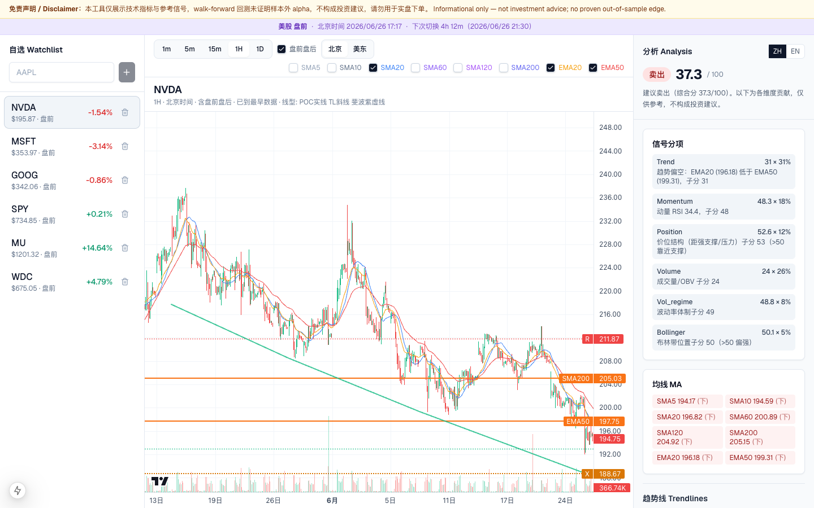
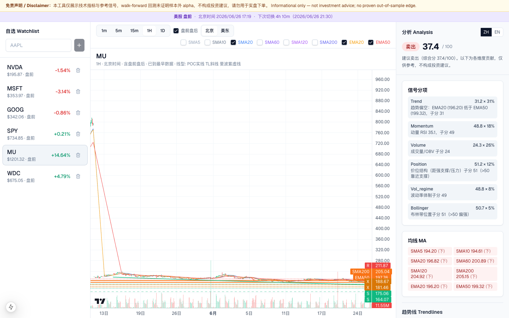
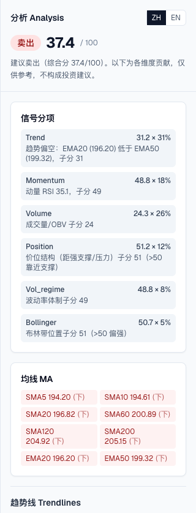

<div align="center">

# 股市参考助手 · Stock Assistant

**美股看盘参考** — 综合信号 · 交易员级支撑/压力 · 多周期 K 线 · 实时推送

<sub>面向个人投资研究参考 · 开源项目，欢迎交流与自用</sub>

<p align="center">
  <a href="https://github.com/caseclose"></a>
  <a href="mailto:fengw2002@gmail.com"></a>
  <a href="mailto:fengwang@stu.pku.edu.cn"></a>
</p>

*US equities reference dashboard — composite signal, trader-grade S/R, candlestick chart with MAs.*

[](backend/)
[](backend/)
[](frontend/)
[](backend/tests/)
[](#)



*自选列表 · 1H K 线（均线 / 斐波那契 / 水平 S/R）· 综合信号与分项归因*

</div>

---

> **免责声明** · 核心逻辑移植自 [quant](https://github.com/caseclose/quant)；walk-forward 未证明样本外 alpha。**仅供参考，不构成投资建议。**
>
> *Informational only — not investment advice.*

## 界面预览 Screenshots

<table>
  <tr>
    <td width="65%">
      
      <p align="center"><sub><b>K 线 + 近端/远端支撑</b> · 水平 S/R · 对角趋势线 · 成交量</sub></p>
    </td>
    <td width="35%">
      
      <p align="center"><sub><b>分析面板</b> · 买卖观望 · 六维信号 · 均线快照</sub></p>
    </td>
  </tr>
</table>

## 功能 Features

### 看盘与数据

- 自选列表（SQLite，最多 20 只）+ Yahoo/Alpaca 报价（盘前盘后默认可用，15s 缓存）
- K 线多周期：1m / 5m / 15m / 1H / 1D（**默认含盘前盘后** bar；可关闭）
- 主图单路 Alpaca WebSocket 实时推送（含 bar 就地更新广播）；其余自选 REST 轮询
- 图表向左拖拽自动分页加载更早历史（`before` + `has_more`）
- 顶部市场状态条（盘前 / 盘中 / 盘后 / 休市 + 倒计时）
- 图表时区切换（美东 / 本地）

### 综合信号

- 买 / 卖 / 观望 + 分项原因（趋势、动量、布林、成交量、波动率、**价位结构**）
- SMA 5/10/20/60/120/200、EMA 20/50 均线开关

### 支撑 / 压力位（交易员级）

日内周期以 **日线结构** 为锚，叠加：

| 来源 | 说明 |
|------|------|
| Swing pivot | 自适应窗口摆动高低点聚类 |
| Volume profile | POC / VAH / VAL |
| Fibonacci | 最近摆动腿的 23.6%–78.6% 回撤 |
| Trendline | 最近两 pivot 投影的水平阻力/支撑 |
| Role flip | 突破后支撑↔阻力角色翻转 |
| **近端 / 远端** | ≤15% 为近端（波段交易）；更远为历史结构 |

每条价位附带：强度、回踩次数、来源标签、翻转标记、walk-forward 命中率、MA 共振、中/英说明。

图表叠加：**水平 S/R 线**、**斐波那契虚线**、**对角趋势线**（日线 pivot，端点映射到日内时间轴）。

## 快速开始 Quick start

### 1. 环境变量

```bash
cp .env.example .env
# 填入 ALPACA_API_KEY / ALPACA_SECRET_KEY（paper 即可）
```

| 变量 | 说明 |
|------|------|
| `ALPACA_API_KEY` / `ALPACA_SECRET_KEY` | Alpaca 密钥 |
| `ALPACA_BASE_URL` | 交易 API（默认 paper） |
| `ALPACA_DATA_URL` | 可选，覆盖行情 REST/WS 端点 |
| `CORS_ORIGINS` | 前端来源，默认 `http://localhost:3000` |
| `WATCHLIST_DB` | 自选库路径，默认 `~/.stock-assistant/watchlist.db` |

### 2. 后端

```bash
cd backend
python3.11 -m venv .venv
source .venv/bin/activate
pip install -e ".[dev]"
uvicorn app.main:app --host 0.0.0.0 --port 8000
```

### 3. 前端

```bash
cd frontend
cp .env.local.example .env.local
npm install
npm run dev -- --hostname 0.0.0.0 --port 3000
# → http://localhost:3000
```

## API（节选）

| Method | Path | 说明 |
|--------|------|------|
| GET | `/api/health` | 健康检查 |
| GET | `/api/market/status` | 美股时段状态与倒计时 |
| GET/POST/DELETE | `/api/watchlist` | 自选 CRUD + 报价 |
| GET | `/api/symbols/{symbol}/bars` | OHLCV + 指标；`limit`≤2000，`before` 分页 |
| GET | `/api/symbols/{symbol}/analysis` | 信号 + S/R + 趋势线 + 原因 |
| POST | `/api/stream/subscribe` | 切换主图 WS |
| WS | `/ws/stream` | 实时 K 线 |

## 测试 Tests

```bash
cd backend && .venv/bin/pytest -q
```

## 更新截图 Refresh screenshots

本地服务运行后：

```bash
npx playwright screenshot http://localhost:3000 docs/screenshots/dashboard.png \
  --viewport-size=1440,900 --wait-for-selector "h1" --wait-for-timeout=15000
```

或 `node scripts/capture_readme_screenshots.mjs`（需先在 `scripts/` 下 `npm install playwright`）。

## 架构要点

- **RTH** — REST 与 WS 统一的盘前盘后过滤
- **StreamHub** — 单槽 Alpaca WS，串行 subscribe，失败不拖死图表
- **结构层** — `levels` + `volume_profile` / `fibonacci` / `trendlines` / `pivots`

## 来源 Attribution

`backend/app/core/` 自 [quant](https://github.com/caseclose/quant) 移植，并扩展 `explain`、`volume_profile`、`fibonacci`、`trendlines`、`level_backtest` 等模块。
